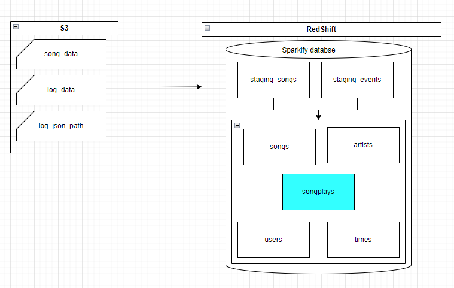
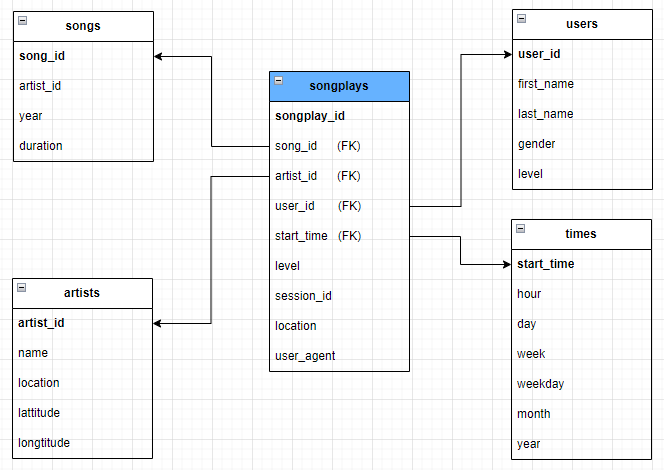

# Project: DSong Play Analysis

## Introduction

A music streaming startup, Sparkify, has grown their user base and song database and want to move their processes and data onto the cloud. Their data resides in S3, in a directory of JSON logs on user activity on the app, as well as a directory with JSON metadata on the songs in their app.

As their data engineer, you are tasked with building an ETL pipeline that extracts their data from S3, stages them in Redshift, and transforms data into a set of dimensional tables for their analytics team to continue finding insights into what songs their users are listening to.


System Architecture for AWS S3 to Redshift ETL

Project using dataset is subset of <a href="http://millionsongdataset.com/">Million Song Dataset</a>

## Project Description

In this project, you'll apply what you've learned on data warehouses and AWS to build an ETL pipeline for a database hosted on Redshift. To complete the project, you will need to load data from S3 to staging tables on Redshift and execute SQL statements that create the analytics tables from these staging tables.

## Project Datasets

You'll be working with 3 datasets that reside in S3. Here are the S3 links for each:

- Song data: `s3://udacity-dend/song_data`

- Log data: `s3://udacity-dend/log_data`

- This third file `s3://udacity-dend/log_json_path.json` contains the meta information that is required by AWS to correctly load `s3://udacity-dend/log_data`

### Song Dataset

The first dataset is a subset of real data from the Million Song Dataset. Each file is in JSON format and contains metadata about a song and the artist of that song. The files are partitioned by the first three letters of each song's track ID. 

### Log Dataset

The second dataset consists of log files in JSON format generated by this event simulator based on the songs in the dataset above. These simulate app activity logs from an imaginary music streaming app based on configuration settings.

## Database Schemas

### System Architecture



### Database schema design



## How to run code

### Install package

#### Create a virtual environment (venv), activate it
```
$ python3 -m venv /path/to/new/venv
$ source venv/bin/activate
```

```
$ pip3 install boto3
$ pip3 install psycopg2-binary
$ pip3 install pandas
$ pip3 install matplotlib
$ pip3 install ipython-sql
$ pip3 install pandas
```

### Open notebook.ipynb

Run code follow by markdown